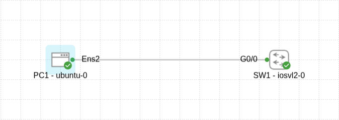
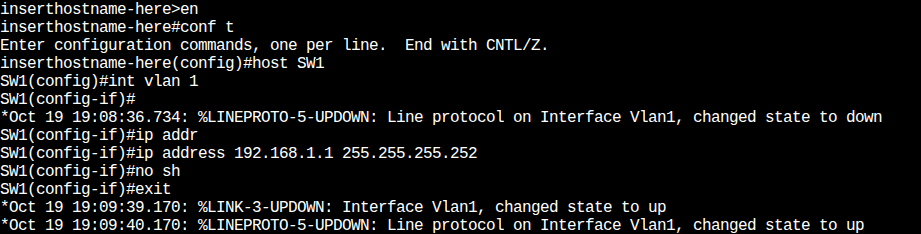
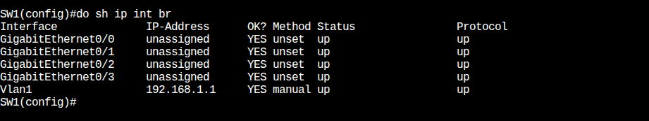
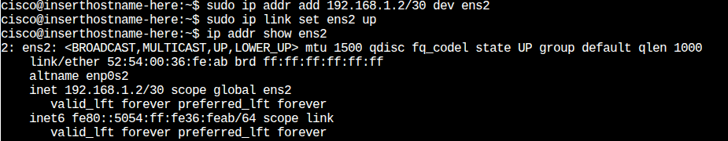
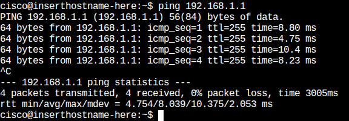

🧩 المشروع 01 — الاتصال بين PC و Switch

🎯 الأهداف التعليمية (Learning Objectives)

من خلال هذا المشروع، أطمح لتحقيق الأهداف التالية:

1- بناء  طوبولوجيا شبكة بسيطة تتكون من جهاز حاسوب ومحول شبكة ضمن بيئة Cisco CML.

2- فهم الدور الأساسي للطبقة الثانية (Layer 2) من نموذج OSI في تمرير الإطارات (Frames) بين الأجهزة المتصلة.

3- تكوين عناوين IP يدوياً على جهاز يعمل بنظام Linux (Ubuntu) وعلى محول Cisco IOSvL2.

4- استخدام أمر ping كأداة أساسية للتحقق من الاتصال على مستوى الطبقة الثالثة (IP).

5- إدراك أهمية واجهة VLAN الافتراضية (SVI - Switched Virtual Interface) للمحولات من الطبقة الثانية، والتي تتيح للمحول الحصول على عنوان IP لأغراض الإدارة واختبار الاتصال.

6- تطبيق مفهوم تجزئة الشبكات (Subnetting)، وتحديداً باستخدام قناع الشبكة /30، لتقليل هدر عناوين IP عند ربط نقطتين فقط.

________

🖥️ الأجهزة المستخدمة :

1 × PC (Ubuntu)

1 × Switch (Cisco IOSvL2)

⚙️ الطوبولوجيا (Topology)

تم بناء الطوبولوجيا الشبكية التالية باستخدام بيئة محاكاة Cisco CML:

PC1 (ubuntu-0): جهاز حاسوب يعمل بنظام Ubuntu.

SW1 (iosvl2-0): محول شبكة من الطبقة الثانية (Layer 2 Switch) من Cisco.

الاتصال: يتم الربط بين PC1 و SW1 بواسطة كابل إيثرنت (RJ45). تم توصيل واجهة ens2 على PC1 بواجهة GigabitEthernet0/0 على SW1.

_____________

⚙️ خطوات التكوين والنتائج (Configuration Steps and Results):

1. تكوين عنوان IP على المحول (SW1) – واجهة VLAN 1

لتمكين المحول SW1 من المشاركة في الطبقة الثالثة لغرض الإدارة والاستجابة لأوامر ping، قمنا بتكوين واجهة VLAN افتراضية تحمل الرقم 1. جميع منافذ المحول تكون جزءاً من VLAN 1 افتراضياً عند الإعداد الأولي:

enable

configure terminal

interface vlan 1

ip address 192.168.1.1 255.255.255.252 #      " لتقليل الهدر subnet 30 استخدمت"

no shutdown

exit

end

 لقطات شاشة توضح عملية التكوين على SW1:

لقطات شاشة توضح عملية  التحقق من التكوين  على SW1:

________________

2-تكوين عنوان IP على جهاز الحاسوب (PC1):

تم تعيين عنوان IP لجهاز PC1 ضمن نفس الشبكة الفرعية /30 التي يتبعها المحول، وذلك لتمكين الاتصال المباشر بين الجهازين ضمن نفس النطاق الشبكي دون الحاجة إلى جهاز توجيه.

sudo ip addr add 192.168.1.2/30 dev ens2

sudo ip link set ens2 up

لقطة شاشة توضح تكوين عنوان IP و التحقق منه  على  PC1:

3. اختبار الاتصال (Ping):

بعد اكتمال تكوين عناوين IP على كل من الجهاز والمحول، قمنا بإجراء اختبار اتصال على مستوى الطبقة الثالثة باستخدام أمر ping من PC1 إلى عنوان IP الخاص بالمحول:

ping 192.168.1.1

لقطة شاشة لنتائج Ping الناجحة:

__________

✅ النتيجة:

تم بنجاح تحقيق الاتصال بين PC1 و SW1 عبر VLAN 1، مما يؤكد سلامة التوصيل الفيزيائي والإعداد المنطقي للشبكة.

🧠 المهارات المكتسبة :

1- التوصيل الفيزيائي للأجهزة (Physical connection)

2- إعداد عناوين IP على الأجهزة

3- تكوين VLAN 1 على المحول (Switch)

4- اختبار الاتصال باستخدام أمر ping

5- استخدام أوامر المراجعة مثل show ip interface brief

🗂️ مستوى المشروع:

Level: Beginner (صفر – المبتدئ جدًا)
