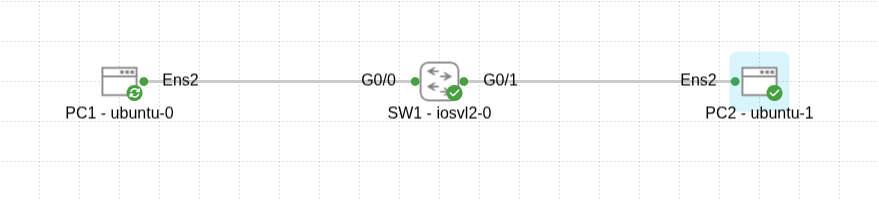
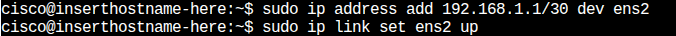
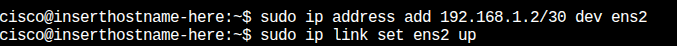
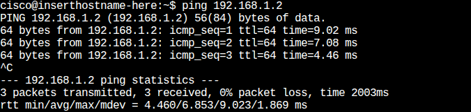
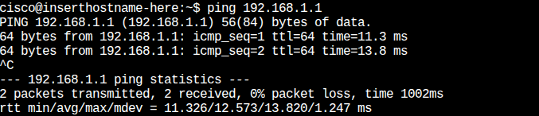

🧩 Project 2: Connecting Two PCs via a Switch Using a /30 IP Network

🎯 الهدف من المشروع (Project Goal) : 

1- فهم كيفية توصيل جهازين كمبيوتر في شبكة محلية (LAN) باستخدام سويتش واحد.    

2- تعلم استخدام Subnetting بقناع ‎/30‎ لتعيين عناوين IP صالحة للأجهزة.    

3- التحقق من الاتصال بين الأجهزة عبر أمر ping.    

________________________________________________________________

📘الوصف العام للمشروع :   

يتكون هذا المشروع من جهازي كمبيوتر (PC1 و PC2) متصلين عبر محول شبكة واحد (SW1).

الهدف هو تمكين الاتصال بين الجهازين في نفس الشبكة المحلية (LAN) باستخدام نطاق عناوين IP صغير.

_______________________________________________________________

  ⚙️  توبولوجيا الشبكة : 
  
  

تتكون الشبكة من جهازي كمبيوتر متصلين بمحول شبكة واحد كما في الصورة أدناه:

________________________________________________________________________________________________________________________________

⚙️   تفاصيل التكوين : 

تم استخدام نطاق عناوين IP بقناع الشبكة ‎**/30**‎، والذي يوفر أربعة عناوين فقط ضمن الشبكة :

1- عنوان الشبكة (Network Address)

2- عنوان البث (Broadcast Address)

3- عنوانان صالحان للأجهزة المضيفة (Hosts)

تم تعيين العناوين على النحو التالي :

1- PC1: 192.168.1.1 

2- PC2: 192.168.1.2 

3- Subnet Mask: 255.255.255.252 (مكافئ لـ /30)

______________________________________________________________________________

ملاحظة: لم يتم إجراء أي تكوين على المحول (SW1)،

لأنه يعمل افتراضيًا في الطبقة الثانية (Data Link Layer)

لتمرير الإطارات بين الأجهزة المتصلة به ضمن الشبكة الافتراضية الافتراضية (Default VLAN).

_____________________________________________

💻 تعيين عناوين IP : 

تعيين عنوان IP لـ PC1 :   

تعيين عنوان IP لـ PC2 :  

__________________________________________________________________________________

📡  اختبار الاتصال (Ping) : 

للتأكد من أن الجهازين يتصلان ببعضهما البعض بنجاح، تم استخدام أمر ping من كل جهاز.

Ping من PC1 إلى PC2 : 

Ping من PC2 إلى PC1 : 

____________________________________________________

 ✅     نتيجة المشروع (Outcome) :
 

1-  تم إنشاء شبكة محلية بسيطة بين جهازي كمبيوتر عبر سويتش واحد.

2- الأجهزة تستطيع الاتصال ببعضها البعض بنجاح.

3- توضح أهمية عناوين IP الصحيحة وكيفية عمل المحولات (Switches) في الطبقة الثانية.        

_________________________________________________________________________________________________

 

🧠 المهارات المكتسبة (Skills Acquired):                                     

1- تعيين عناوين IP ضمن Subnet محدد (/30).                              

2- فهم دور الشبكات المحلية (LAN) وكيفية عمل المحولات (Switches) في الطبقة الثانية.                               

3- اختبار الاتصال بين الأجهزة باستخدام ping.                    

4- قراءة ورسم توبولوجيا شبكة بسيطة.                                         

__________________________________________________________

 

🗂️ مستوى المشروع (Project Level):                                                                            

مبتدئ / Beginner
