🧩 مشروع فهم نطاقات البث (Broadcast Domains) باستخدام VLANs

مقدمة :

في هذا المشروع العملي، سنتعلم كيف تتحكم تقنية الـ VLANs (الشبكات المحلية الافتراضية) في نطاقات البث (Broadcast Domains) لتقسيم الشبكة وزيادة أمنها وكفاءتها.

__________________________________________

🎯 الأهداف : 

1- فهم مفهوم نطاق البث.

2- تعلم تهيئة الـ VLANs على المحول.

3- اختبار عزل الشبكة بواسطة الـ VLANs.

4- تطبيق تهيئة عناوين IP للأجهزة.

📁 وصف عام المشروع :

سنقوم بإنشاء شبكة بسيطة مكونة من اجهزه 4 pc  و switch واحد.

في البداية، ستكون جميع الأجهزة قادرة على الاتصال ببعضها   بعد ذلك، سنقسم الأجهزة منطقياً إلى مجموعتين (مبيعات وتسويق) باستخدام VLANs على المحول.

سنلاحظ كيف أن هذا التقسيم يمنع المجموعتين من الاتصال ببعضهما البعض، مما يوضح عزل نطاقات البث.

__________________________________________________________________________

⚙️ توبولوجيا الشبكه :

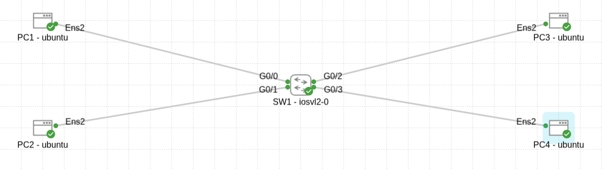

_______________________________________________________________________________

💻 تخطيط عناوين IP :

| PC1 |     VLAN 10 (Sales)    | 192.168.10.1/29 |

| PC2 |    VLAN 10 (Sales)     | 192.168.10.2/29 |

| PC3 |   VLAN 20 (Marketing)  | 192.168.10.9/29 |

| PC4 |   VLAN 20 (Marketing)    | 192.168.10.10/29 |

Subnet Mask: 255.255.255.248

Switch: 1x Switch Layer 2

VLANs على المحول:

VLAN 10: Sales → PC1, PC2 

VLAN 20: Marketing  →PC3,PC4

____________________________________________________

الخطوات والتنفيذ :

1. تهيئة عناوين IP على أجهزة الكمبيوتر

قم بتعيين عناوين IP لكل جهاز كما هو موضح في الجدول أعلاه.

PC1 :

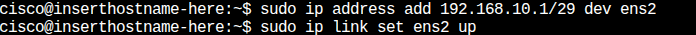

PC2 :

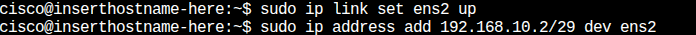

PC3 :

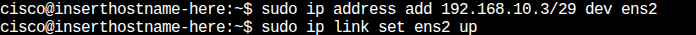

PC4 :

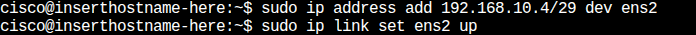

__________________________________________________________________________

 2. اختبار الاتصال قبل تهيئة VLANs :
 
 

1-  تحقق أن جميع الأجهزة يمكنها الاتصال ببعضها قبل تفعيل VLANs.

2-  مثال: Ping من PC4 إلى PC1.

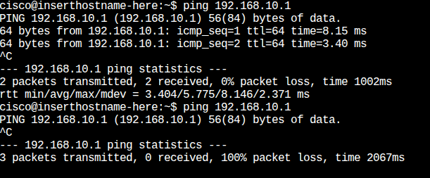

____________________________________________________

3. تهيئة VLANs على المحول (Switch) :

استخدم الأوامر التالية لإنشاء VLANs وتعيين المنافذ:

enable

configure terminal

hostname Sw1

vlan 10

name Sales

vlan 20

name Marketing

exit

interface FastEthernet0/1  # منفذ PC1

switchport mode access

switchport access vlan 10

exit

interface FastEthernet0/2  # منفذ PC2

switchport mode access

switchport access vlan 10

exit

interface FastEthernet0/3  # منفذ PC3

switchport mode access

switchport access vlan 20

exit

interface FastEthernet0/4  # منفذ PC4

switchport mode access

switchport access vlan 20

exit

end

write memory

ملاحظة : الأوامر مكتوبة بشكل كامل للتوضيح لكن يمكن اختصارها اثناء التطبيق الفعلي للمحول .

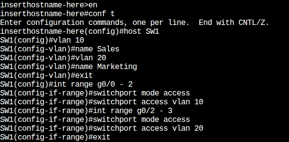

________________________________________________

📡 اختبار العزل بعد تفعيل VLANs :

قم بإجراء اختبارات Ping التالية ولاحظ النتائج .

PC1 → PC2 :

نجاح  VLAN ✅

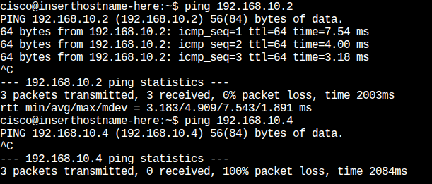

PC1 → PC4 :

فشل VLAN مختلف❌

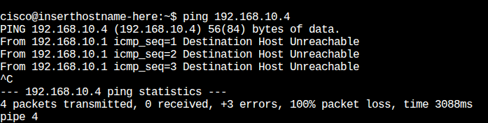

PC4 → PC3 :

نجاح  VLAN ✅

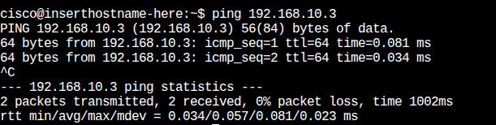

PC4 → PC1 : 

فشل (VLAN مختلف )❌

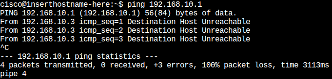

__________________________________________________

✅النتيجة النهائية: 

لقد نجحنا في تقسيم الشبكة باستخدام VLANs، مما أدى إلى عزل مجموعتي “المبيعات” و”التسويق”.

هذا يوضح كيف أن VLANs تخلق نطاقات بث منفصلة حتى على نفس المحول، مما يعزز أمن الشبكة ويقلل حركة البث غير الضرورية.

__________________________________________________________________

🧠المهارات المكتسبة: 

1- فهم نطاقات البث (Broadcast Domains) والـ VLANs.

2- تهيئة عناوين IP للأجهزة.

3- استخدام أوامر سطر الأوامر (CLI) للمحول.

4- تطبيق العزل الشبكي واختباره.

5- تعزيز فهم أمن وكفاءة الشبكة.

6- تحليل نتائج اختبار الاتصال (Ping) وتفسيرها لقياس العزل الشبكي.
